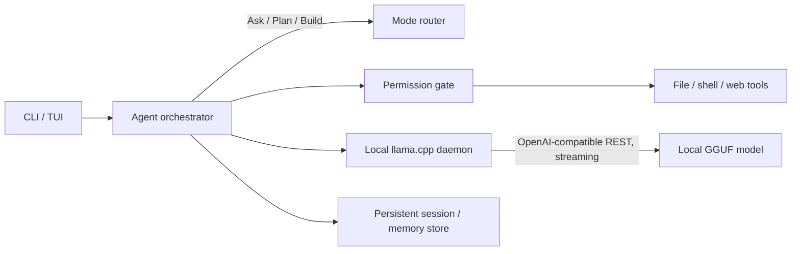
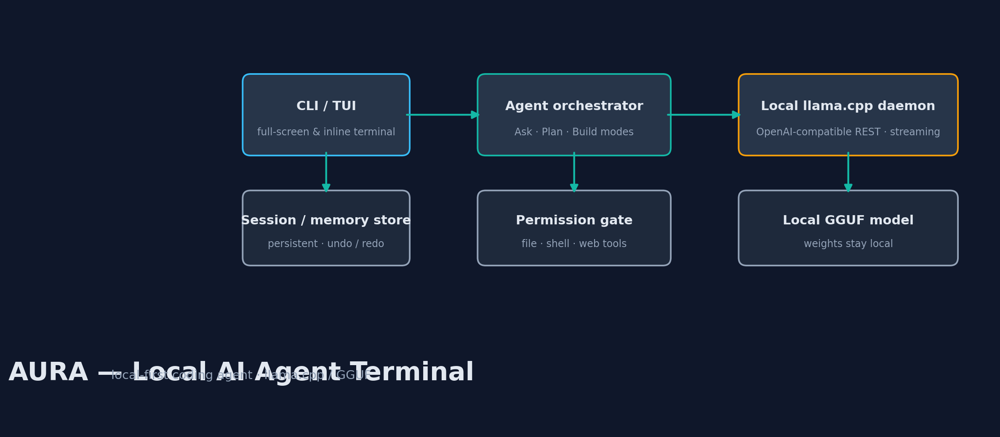

# AURA — Local AI Agent Terminal (Sanitized Engineering Showcase)

> A private local-first coding-agent terminal presented as a public, architecture-first engineering case study.

AURA is a terminal-based coding agent that runs entirely against a local LLM (llama.cpp/GGUF) rather than a cloud API. This showcase demonstrates the agent-architecture, tool-orchestration, and runtime engineering behind it, without publishing the actual source implementation, prompts, or session data.

## Engineering contribution

- **Agent modes**: Ask (read-only Q&A), Plan (structured implementation planning), and Build (tool-executing implementation) as distinct operating modes with different permission surfaces.
- **Permission-gated tool execution**: file, shell, and web tools are only invoked through an explicit permission gate — the agent cannot silently write files, run commands, or hit the network.
- **Local daemon runtime**: the CLI launches and manages a background llama.cpp server process that persists across sessions, exposing an OpenAI-compatible local REST endpoint with streaming responses — the TUI attaches to it rather than re-loading the model per request.
- **Persistent session/memory state**: conversation sessions, undo/redo history, and long-term memory notes are stored locally and survive restarts.
- **Full-screen and inline TUI**: a Rich/prompt-toolkit based terminal interface with RTL-aware rendering.
- **pytest QA discipline**: an automated test suite covers agent core behavior, daemon lifecycle, streaming, and RTL rendering.

## Public boundary

This is a sanitized showcase, not the production source. It deliberately excludes the actual agent implementation, system prompts, tool-execution internals, permission-policy logic, session/memory data, and the local model weights. What's documented here is the architecture and engineering approach, not the code.

## Architecture

## Technology

Python, llama.cpp/GGUF, Rich, prompt-toolkit, pytest.

## QA approach

The private project validates agent-core behavior, daemon start/stop lifecycle, streaming response handling, and RTL text rendering through an automated pytest suite. This showcase does not include the test suite itself, only the fact that one exists and what it covers.

## Visual overview

## Demo

No screenshots are included yet — this section is reserved for a future terminal-session recording or screenshot once one is captured and reviewed for anything session/path-specific before publishing.

## License

MIT for the documentation in this repository. The private AURA implementation is not licensed or included.
